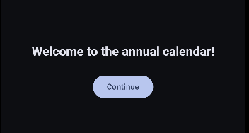
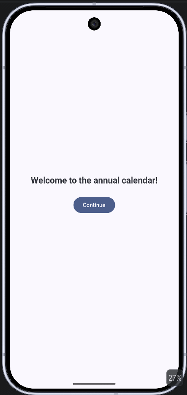

<h1>

 
</h1>

# Annual Calendar App 

A simple Android productivity app built with Kotlin and Jetpack Compose.
This project allows users to create and manage monthly objectives through an interactive and animated interface.

## Features

- Monthly goal organization and resque
- Expandable cards
- Animated UI transitions
- State management with rememberSaveable
- Material 3 Design
- Dark mode support
- Responsive Compose UI

## Technologies Used

- Kotlin
- Jetpack Compose
- Material 3
- Android Studio

## Demo

<h1>

 

</h1>

## What I Learned

This project helped me practice:

- Jetpack Compose fundamentals
- State management
- LazyColumn
- TextField
- Animations in Compose
- Composable functions
- MaterialTheme customization

## Future Improvements

- Save goals locally
- Add notifications/reminders
- User authentication
- Calendar integration
- Cloud synchronization

## Author

Tiago Andrade